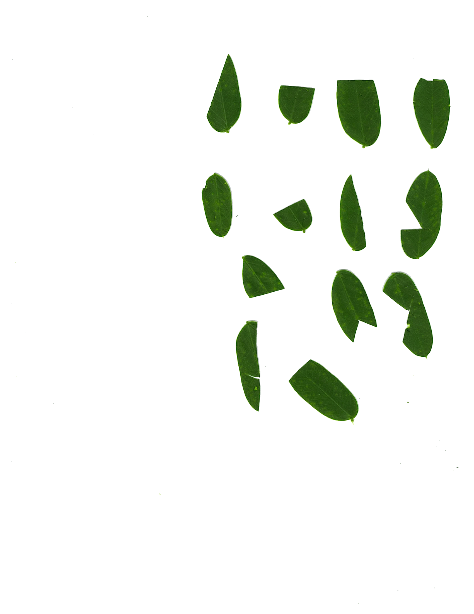
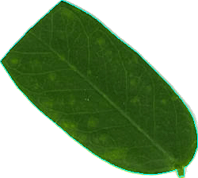
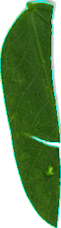
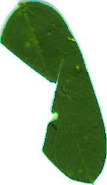
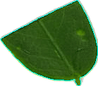
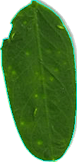
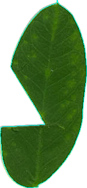
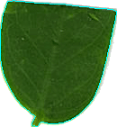

# HerbQuant

This project aims to automate the measurement of quantifying herbivory.
Currently the code is able to extract leaves from a scanned image of many leaflets and provide precise
measurements of each individual leaflet, further work will attempt to improve on this by attempting to
automatically quantify the herbivory, that is the amount of area missing due to herbivorous activity, 
of each leaf. This solution would be able to replace other methods which are slower, less precise, and may
cost orders of magnitude more money to implement.

## Usage
place scanned images containing multiple leaflets into the `samples/` directory. The script will scan that
directory and process any png images there. Extracted leaflets will be placed into the `images/` directory
(make sure this directory exists before execution of the script). Finally, the leaves will be measured and
this measurement data will be dumped into a file `data.csv`

This image:

Becomes all of these images:  

